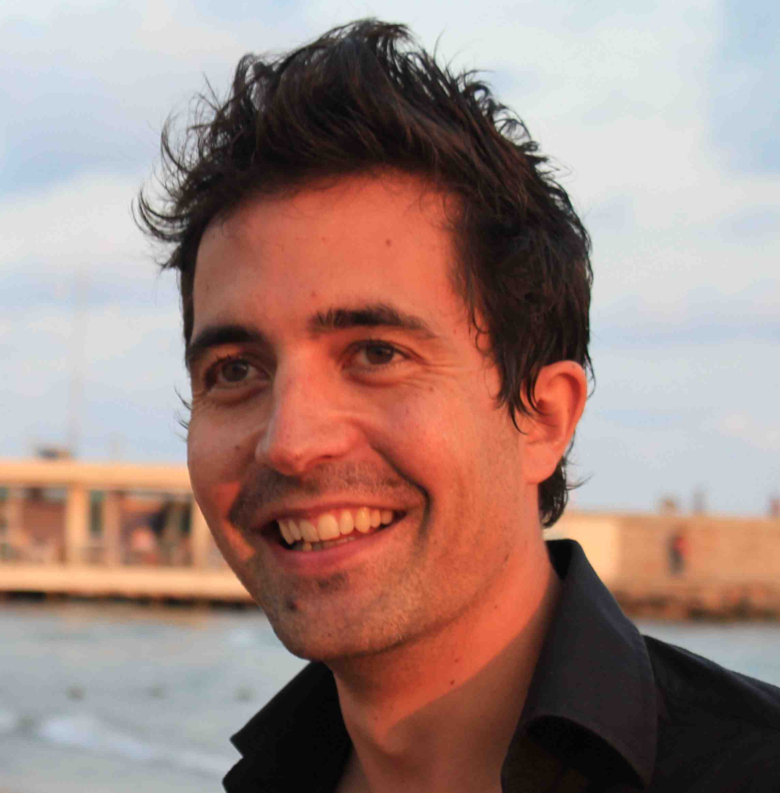

About

# Sisyphe is a small company with a long run-up.

::: {.founder}

**Sylvain Le Groux** is the founder and, for now, the whole engineering team.

He spent the last decade in the Bay Area shipping speech and language models to millions of users: principal AI engineer at Cisco after it acquired Voicea, senior machine learning engineer at Voicea, senior speech scientist at Ava, and before that data scientist at Ginger.io. Since 2025 the day job is robotics and embodied AI.

He spent the decade before that in research: a postdoc in Stanford's psychophysiology lab on emotion and sound, an assistant professorship at Pompeu Fabra University in Barcelona running European research projects on synthetic, perceptive, emotive and cognitive systems, and a year teaching at Georgia Tech's Center for Music Technology.

Ph.D. in computer and cognitive science, summa cum laude, with the Consortium for Advanced Studies in Barcelona's Ph.D. award. M.A. in music composition. M.Sc. in engineering from King's College London, D.E.A. ATIAM from IRCAM and the Sorbonne. Fulbright and Georges Lurcy fellow at UC Berkeley. Finalist, Cisco Data Science Awards 2020. Second place, Sónar+D Innovation Challenge 2021. Flute diplomas from the Nantes conservatoire, then jazz, world music and free improvisation, and these days mostly electronic music.

:::

## What the company is for

Sisyphe exists to build AI that acts in the world: agents that perceive a live environment and work inside it, whether that is a DAW, a simulator, a robot or an art collection. The bet is simple: a model that can see the whole environment and notice what changed is more useful than a chatbot beside it with a list of commands. Sisyphe began in 2023 as a consulting practice: real-time conversational voice for Persona, music source separation advisory for Parts Order, fractional CTO for Tamada's AI-augmented art curation. Sideman, in 2026, is its first product. The course teaches it. Consulting pays for it and keeps us honest about what works outside our own studio.

Sisyphe is independent of any employer. Client work never touches what the founder does at a day job, and the day job is not for hire here.

## Elsewhere

- Resume, research and the full portfolio: [ccrma.stanford.edu/~slegroux](https://ccrma.stanford.edu/~slegroux)
- Code: [github.com/slegroux](https://github.com/slegroux)
- LinkedIn: [linkedin.com/in/slegroux](https://www.linkedin.com/in/slegroux)
- Email: [sylvain.legroux@gmail.com](mailto:sylvain.legroux@gmail.com)

## Sisyphe LLC

The name is the French spelling of Sisyphus. The footer is Camus, with one word changed.
