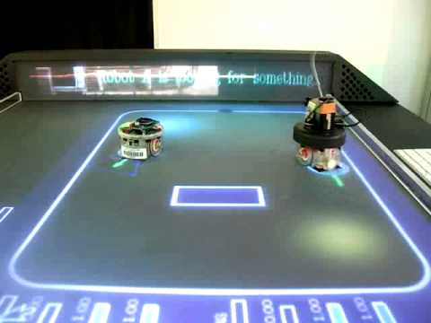
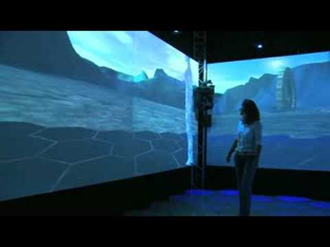
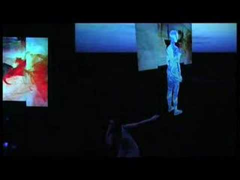

About

# Sisyphe is a small company with a long run-up.

## What Sisyphe does

Sisyphe builds AI for art, music and creative tools: agents that perceive a live environment and work inside it, whether that is a DAW, a stage, a gallery or an archive. The bet is simple: a model that can see the whole environment and notice what changed is more useful than a chatbot beside it with a list of commands. Sisyphe began in 2023 as a consulting practice: real-time conversational voice for Persona, music source separation advisory for Parts Order, fractional CTO for Tamada on an AI art curation engine for Visto. Sideman, in 2026, is its first product. The course teaches it. Consulting pays for it and keeps us honest about what works outside our own studio.

Sisyphe is independent of any employer. Client work never touches what the founder does at a day job, and the day job is not for hire here.

## Who runs it

::: {.founder}

**Sylvain Le Groux** founded Sisyphe after two decades between research and industry: interactive music systems and emotion research in labs in Barcelona and at Stanford, then speech and language models shipped to millions of users at Voicea and Cisco. Ph.D. in computer and cognitive science, a trained musician who performs live melodic techno, based in Santa Monica. The full story, papers and awards are on [his personal site](https://ccrma.stanford.edu/~slegroux).

:::

## Before Sisyphe: twenty years of art and technology {#background}

::: {.lede .muted}
Interactive music systems, performances and installations, most of them built in research labs in Barcelona, long before the company. They are why art and music are not new territory for Sisyphe. What the company itself has built is on [Projects](projects.html).
:::

<a class="tile" href="https://ccrma.stanford.edu/~slegroux/portfolio/performances/moving_paintings.html"><svg class="tile-ill" viewBox="0 0 320 180" role="img" aria-label="Brushstrokes drifting into motion"><rect width="320" height="180" fill="var(--panel-2)"/><path d="M20 130 C 80 60, 140 150, 200 80 S 290 40, 305 70" fill="none" stroke="var(--act)" stroke-width="14" stroke-linecap="round" opacity="0.85"/><path d="M30 70 C 90 30, 150 110, 230 50" fill="none" stroke="var(--perceive)" stroke-width="10" stroke-linecap="round" opacity="0.8"/><path d="M60 160 C 120 120, 200 170, 290 120" fill="none" stroke="var(--reason)" stroke-width="12" stroke-linecap="round" opacity="0.8"/></svg>2022<strong>Moving Paintings</strong>Still paintings dreamed into motion with diffusion models.See →</a>
<a class="tile" href="https://www.youtube.com/watch?v=HDmjGJ9sqeI">2010 · Sónar<strong>The Robot Arena</strong>Robots in an arena drive a score generated live.Watch →</a>
<a class="tile" href="https://vimeo.com/35514990">2009<strong>The Brain Orchestra</strong>A string quartet played by four people's brain signals.Watch →</a>
<a class="tile" href="https://www.youtube.com/watch?v=XAlptm4aHNA">2007–2009<strong>XIM</strong>A mixed-reality room that composes music from how people move through it.Watch →</a>
<a class="tile" href="https://www.youtube.com/watch?v=qln4f1kUpZU">2007<strong>Re(per)curso</strong>Dance, narrative, live synthetic composition and video on one stage.Watch →</a>

Awards, papers and the full portfolio, including the bands, the free-improvisation ensembles and the research behind each system, are on [Sylvain's personal site](https://ccrma.stanford.edu/~slegroux/portfolio/).

## Elsewhere

- Resume, research and the full portfolio: [ccrma.stanford.edu/~slegroux](https://ccrma.stanford.edu/~slegroux)
- Code: [github.com/slegroux](https://github.com/slegroux)
- LinkedIn: [linkedin.com/in/slegroux](https://www.linkedin.com/in/slegroux)
- Email: [sylvain.legroux@gmail.com](mailto:sylvain.legroux@gmail.com)

## Sisyphe LLC

Santa Monica, California. The name is the French spelling of Sisyphus. The footer is Camus, with one word changed.


