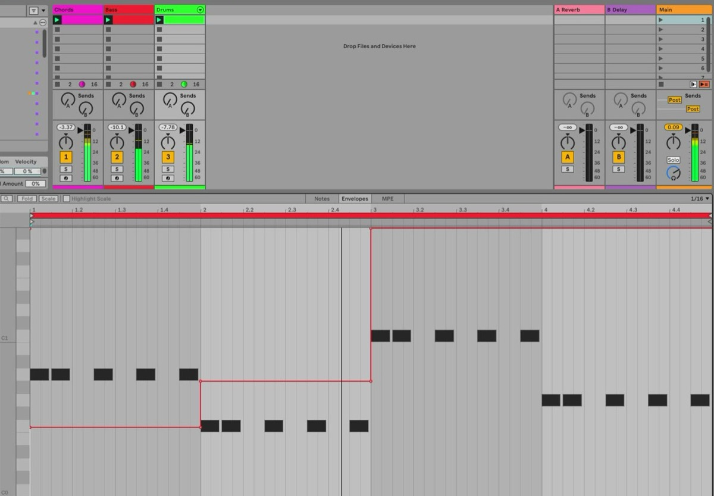
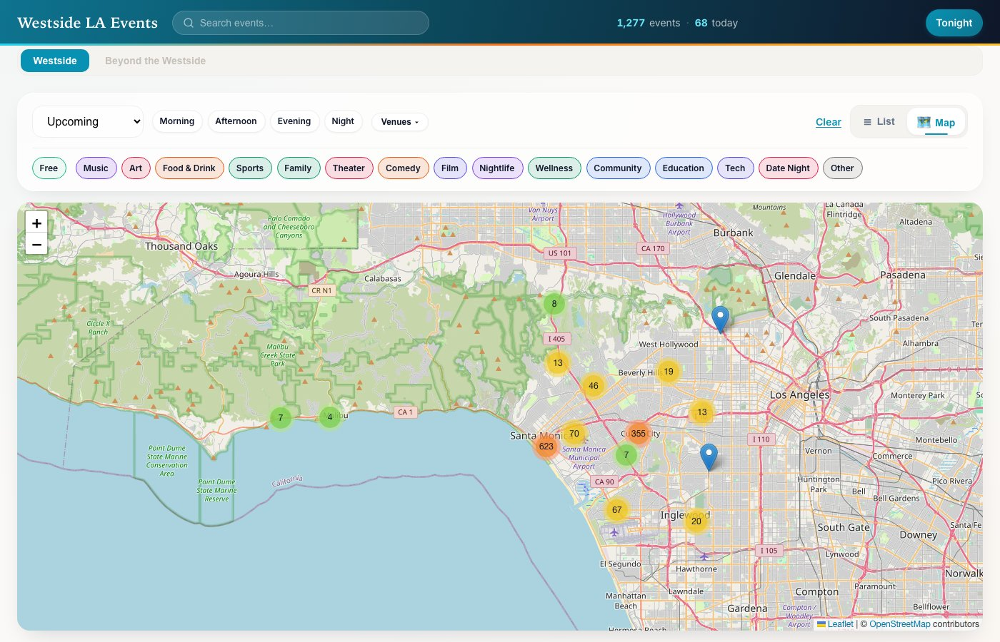

Lineage

# Two decades of situated systems, one idea.

::: {.lede .muted}
Sideman is not the first system we have built that perceives what is happening and answers with an action. A room that composes from how you move through it and a policy that drives a robot from what its camera sees are the same problem with different actuators. Each entry below is tagged with the layers it worked hardest on.
:::

::: {.timeline}

::: {.tl}

2026

### mjdrone and sim-to-real

Simulation · sim-to-real · personal projects

perceiveact

A MuJoCo quadrotor simulator that speaks MAVLink, so flight scripts written for the Udacity course simulator connect unchanged, headless at 30 to 60 times real time. Alongside it, a personal sim-to-real project on NVIDIA Cosmos. The actuator is a machine this time, simulated for now.

<svg class="ill" viewBox="0 0 400 300" role="img" aria-label="A quadrotor above a grid floor, with its camera view and a planned path">
  <g class="ink3" stroke-width="1" fill="none" opacity="0.6">
    <path d="M40 250 L360 250 M60 225 L340 225 M80 202 L320 202 M100 181 L300 181 M120 162 L280 162"/>
    <path d="M60 145 L40 250 M105 145 L120 250 M150 145 L200 250 M195 145 L280 250 M240 145 L360 250"/>
  </g>
  <path class="ps" d="M200 96 L120 250 M200 96 L280 250" stroke-width="1.5" stroke-dasharray="4 4" fill="none" opacity="0.8"/>
  <path class="as" d="M70 200 C 130 120, 220 130, 300 70" stroke-width="3" fill="none" stroke-linecap="round" stroke-dasharray="1 9"/>
  <circle class="a" cx="300" cy="70" r="6"/>
  <g transform="translate(200 96)">
    <path class="ink" d="M-40 -14 L40 14 M40 -14 L-40 14" stroke-width="4" stroke-linecap="round"/>
    <rect class="fill-panel ink" x="-14" y="-9" width="28" height="18" rx="4" stroke-width="2"/>
    <circle class="p" cx="-40" cy="-14" r="11" opacity="0.9"/><circle class="p" cx="40" cy="-14" r="11" opacity="0.9"/>
    <circle class="p" cx="-40" cy="14" r="11" opacity="0.9"/><circle class="p" cx="40" cy="14" r="11" opacity="0.9"/>
    <circle class="r" cx="0" cy="0" r="4"/>
  </g>
  <text class="cap" x="40" y="280">sim · 30–60× real time</text>
</svg>

:::

::: {.tl}

2026

### Sideman

Ableton Live MCP server · open source

perceivereasonact

All three layers in one box. Observers report what you do by hand, a skill teaches the model how Live's paths are shaped, and thirty tools write into the Set with real undo. [About Sideman →](sideman.html)

:::

::: {.tl}

2026

### Sidekick

Learning notebook · personal project · after Answer.AI's SolveIt

perceivereason

A notebook for learning with an AI beside you, not in your place. Every cell is live, and the AI reads the cells above the one you ask from. It can search the web and read papers and pages converted to text, but by default it cannot write files or run code: running the code stays the learner's job. The same notebook runs on a laptop or on a remote GPU. The step-by-step method is Answer.AI's SolveIt; the notebook is ours.

<svg class="ill" viewBox="0 0 400 300" role="img" aria-label="A notebook of note, code and question cells, with the AI allowed to read and search but locked out of running code">
  <rect class="fill-panel ink" x="40" y="24" width="250" height="236" rx="8" stroke-width="2"/>
  <g class="ink3" stroke-width="3" stroke-linecap="round"><path d="M60 50 H170 M60 64 H230 M60 78 H200"/></g>
  <rect class="fill-panel ink" x="56" y="96" width="218" height="58" rx="5" stroke-width="1.5"/>
  <g class="ps" stroke-width="3" stroke-linecap="round"><path d="M70 114 H120 M128 114 H170 M70 128 H100 M108 128 H190 M70 142 H140"/></g>
  <text class="cap" x="240" y="148">run</text>
  <rect class="fill-panel ink" x="56" y="170" width="218" height="72" rx="5" stroke-width="1.5"/>
  <circle class="r" cx="74" cy="188" r="7"/>
  <g class="rs" stroke-width="3" stroke-linecap="round"><path d="M90 188 H200 M74 210 H250 M74 224 H220"/></g>
  <path class="rs" d="M290 206 C 325 206, 344 170, 344 130" stroke-width="2" fill="none" stroke-dasharray="4 5"/>
  <g transform="translate(344 96)">
    <circle class="r" cx="0" cy="0" r="22" opacity="0.9"/>
    <text class="cap" x="0" y="42" text-anchor="middle">reads · searches</text>
  </g>
  <g transform="translate(344 214)">
    <rect class="fill-panel ink" x="-14" y="-4" width="28" height="22" rx="4" stroke-width="2"/>
    <path class="ink" d="M-8 -4 V-12 A8 8 0 0 1 8 -12 V-4" fill="none" stroke-width="2"/>
    <text class="cap" x="0" y="40" text-anchor="middle">won't run it</text>
  </g>
  <text class="cap" x="40" y="290">note · code · ask · you run it</text>
</svg>

:::

::: {.tl}

2025–2026

### Westside LA Events

Events aggregator · personal project · <a href="https://westside-events-406046958598.us-west1.run.app">live</a>

perceive

Sixty scrapers over venues, museums and community calendars on LA's Westside, unified into one search with maps and analytics, deployed on Cloud Run. A city as an archive: the perceive layer, at civic scale.

:::

::: {.tl}

2023–2025

### Sisyphe, the practice

Persona · Parts Order · Tamada

perceivereason

Sisyphe started as a consulting practice. Real-time conversational voice pipelines for Persona, scientific advice on music source separation for Parts Order, and fractional CTO for Tamada, where the team built visual search over an art collection on CLIP embeddings and a vector index. An archive as an environment.

<svg class="ill" viewBox="0 0 400 300" role="img" aria-label="Three engagements: voice, source separation, art curation">
  <g transform="translate(30 70)"><rect class="fill-panel ink" x="0" y="0" width="100" height="130" rx="8" stroke-width="2"/>
    <g class="p"><rect x="26" y="52" width="5" height="26" rx="2"/><rect x="36" y="40" width="5" height="50" rx="2"/><rect x="46" y="30" width="5" height="70" rx="2"/><rect x="56" y="44" width="5" height="42" rx="2"/><rect x="66" y="56" width="5" height="18" rx="2"/></g>
    <text class="cap" x="0" y="155">voice</text></g>
  <g transform="translate(150 70)"><rect class="fill-panel ink" x="0" y="0" width="100" height="130" rx="8" stroke-width="2"/>
    <g class="rs" stroke-width="4" stroke-linecap="round" fill="none"><path d="M20 40 H80"/><path d="M20 65 H60"/><path d="M20 90 H72"/></g>
    <g class="r"><circle cx="80" cy="65" r="5"/><circle cx="80" cy="90" r="5"/></g>
    <text class="cap" x="0" y="155">stems</text></g>
  <g transform="translate(270 70)"><rect class="fill-panel ink" x="0" y="0" width="100" height="130" rx="8" stroke-width="2"/>
    <rect class="as" x="22" y="28" width="56" height="44" rx="3" stroke-width="3" fill="none"/><rect class="a" x="30" y="86" width="40" height="8" rx="2" opacity="0.8"/><rect class="a" x="30" y="100" width="24" height="8" rx="2" opacity="0.5"/>
    <text class="cap" x="0" y="155">curation</text></g>
  <text class="cap" x="30" y="260">persona · parts order · tamada</text>
</svg>

:::

::: {.tl}

2016–2023

### Speech at scale

Ava · Voicea · Cisco

perceivereason

Multilingual speech recognition, speaker diarization, synthesis and language modelling shipped to millions of Webex users, and a US patent on privacy-preserving speech recognition with federated learning. The perception layer at scale. Nimrod, a personal open-source toolkit for speech, audio and language modelling, came out of this period.

<svg class="ill" viewBox="0 0 400 300" role="img" aria-label="A waveform becoming a sequence of tokens">
  <g class="p">
    <rect x="40" y="130" width="6" height="40" rx="3"/><rect x="52" y="110" width="6" height="80" rx="3"/><rect x="64" y="95" width="6" height="110" rx="3"/><rect x="76" y="120" width="6" height="60" rx="3"/><rect x="88" y="80" width="6" height="140" rx="3"/><rect x="100" y="105" width="6" height="90" rx="3"/><rect x="112" y="135" width="6" height="30" rx="3"/><rect x="124" y="115" width="6" height="70" rx="3"/><rect x="136" y="90" width="6" height="120" rx="3"/><rect x="148" y="125" width="6" height="50" rx="3"/><rect x="160" y="140" width="6" height="20" rx="3"/>
  </g>
  <path class="ink" d="M185 150 L225 150 M216 142 L225 150 L216 158" stroke-width="2" fill="none" stroke-linecap="round"/>
  <g>
    <rect class="r" x="240" y="86" width="44" height="26" rx="5"/><text class="mono" x="262" y="99">say</text>
    <rect class="r" x="292" y="86" width="30" height="26" rx="5"/><text class="mono" x="307" y="99">it</text>
    <rect class="r" x="240" y="122" width="34" height="26" rx="5"/><text class="mono" x="257" y="135">it</text>
    <rect class="r" x="282" y="122" width="58" height="26" rx="5"/><text class="mono" x="311" y="135">lands</text>
    <rect class="r" x="240" y="158" width="30" height="26" rx="5"/><text class="mono" x="255" y="171">in</text>
    <rect class="r" x="278" y="158" width="48" height="26" rx="5"/><text class="mono" x="302" y="171">your</text>
    <rect class="a" x="240" y="194" width="42" height="26" rx="5"/><text class="mono" x="261" y="207">Set</text>
  </g>
  <text class="cap" x="40" y="280">asr · tts · diarization · lm</text>
</svg>

:::

::: {.tl}

2010

### The Robot Arena

Sónar, Barcelona · SPECS

perceivereason

The behaviour of robots in an arena modulates a musical composition generated live by SiMS, the Situated Interactive Music Server. Its biomimetic architecture uses algorithmic composition, sound synthesis and expression rules validated in psychoacoustics and emotion experiments.


:::

::: {.tl}

2009

### The Brain Orchestra

Brain-computer interface · with SPECS, Jonatas Manzolli and g.tec

perceiveact

Four performers control the expressivity of a virtual string quartet with their brain signals alone. Sylvain designed and built the interactive music system on top of the BCI, produced the music with Decco, and played live guitar and electronics.


:::

::: {.tl}

2007–2009

### The eXperience Induction Machine

Mixed reality space · SPECS, Barcelona

perceivereasonact

A real-world composition and performance system inside a large intelligent multimodal space. The music is produced in real time by the interaction between the system and its human and non-human environment. The music system inside XIM became the subject of the Ph.D.: a room as an instrument.


:::

::: {.tl}

2007

### Re(per)curso

Multimedia performance · SPECS and Jonatas Manzolli

perceiveact

Narrative, music and dance fused with real-time synthetic composition, video art and 3D graphics. Sylvain designed the interactive music system, integrated it with the lab's neural network simulator, built the software for an interactive percussion carpet, produced the music and played live electronics.


:::

:::

## Recognition

::: {.recog}

2021Second place, Sónar+D Innovation ChallengeBarcelona

2021Teaching assistant, Ryan Tedder's songwriting studio, one of 15 chosen from 2,800 applicantsRemote

2020Finalist, Cisco Data Science AwardsMilpitas

2012Best Performance, Sónar Music Hack DayBarcelona

2012Ph.D. Award, Consortium for Advanced Studies in BarcelonaStanford

2011Best Hack, Sónar Music Hack DayBarcelona

2011Doctor summa cum laude, Universitat Pompeu FabraBarcelona

2008Research award, Generalitat de CatalunyaStanford

2004Fulbright and Georges Lurcy FellowUC Berkeley

:::

The full portfolio, including the bands, the free-improvisation ensembles and the research behind each system, is on [Sylvain's personal site](https://ccrma.stanford.edu/~slegroux/portfolio/).
