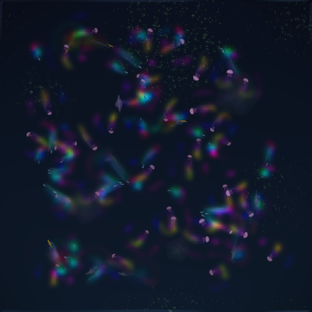

Projects

# What we have built.

::: {.lede .muted}
Products, public tools, personal projects and client work, almost all of it since Sisyphe began in 2023. Each card is tagged with the layers it works hardest on: perceive, reason, act. For the two decades before, see [the background](about.html#background).
:::

<nav class="jump" aria-label="Sections"><a href="#music">Music production</a> · <a href="#agents">Agents & simulated worlds</a> · <a href="#creative-ml">Creative ML</a> · <a href="#learning-culture">Learning & culture</a> · <a href="#clients">Client work</a></nav>

## Music production {#music}

::: {.group-lede .muted}
Tools that work inside your DAW, on your session, with real undo.
:::

::: {.projgrid}
::: {.proj data-layers="perceive reason act"}

Product · 2026 · Ableton Live MCP server

### Sideman

perceivereasonact

Gives Claude the whole of Ableton Live through Live's own object model. Observers report what you do by hand, a skill teaches the model how Live's paths are shaped, and thirty tools write into the Set with real undo.
<a class="card-link" href="sideman.html">About Sideman →</a>

:::

::: {.proj data-layers="perceive act"}

<svg class="ill" viewBox="0 0 400 300" role="img" aria-label="One mixed waveform splitting into four coloured stem lanes">
  <g class="ink3">
    <rect x="30" y="120" width="5" height="60" rx="2"/><rect x="40" y="100" width="5" height="100" rx="2"/><rect x="50" y="112" width="5" height="76" rx="2"/><rect x="60" y="90" width="5" height="120" rx="2"/><rect x="70" y="108" width="5" height="84" rx="2"/><rect x="80" y="96" width="5" height="108" rx="2"/><rect x="90" y="118" width="5" height="64" rx="2"/><rect x="100" y="104" width="5" height="92" rx="2"/>
  </g>
  <g class="ink3" fill="none" stroke-width="1.5">
    <path d="M115 150 C 150 150, 150 60, 185 60"/><path d="M115 150 C 150 150, 150 120, 185 120"/><path d="M115 150 C 150 150, 150 180, 185 180"/><path d="M115 150 C 150 150, 150 240, 185 240"/>
  </g>
  <rect class="fill-panel ink" x="190" y="44" width="180" height="32" rx="4" stroke-width="1.5"/><path class="as" d="M198 60 C 220 48, 240 72, 262 60 S 306 48, 328 60 S 350 72, 362 60" stroke-width="3" fill="none"/>
  <rect class="fill-panel ink" x="190" y="104" width="180" height="32" rx="4" stroke-width="1.5"/><g class="ps" stroke-width="3" stroke-linecap="round"><path d="M204 112 V128 M232 112 V128 M260 112 V128 M288 112 V128 M316 112 V128 M344 112 V128"/></g>
  <rect class="fill-panel ink" x="190" y="164" width="180" height="32" rx="4" stroke-width="1.5"/><path class="rs" d="M198 180 H230 M240 172 H280 M290 186 H330 M338 176 H362" stroke-width="3" fill="none" stroke-linecap="round"/>
  <rect class="fill-panel ink" x="190" y="224" width="180" height="32" rx="4" stroke-width="1.5"/><path class="ink" d="M200 240 C 215 232, 225 248, 240 240 M280 240 C 295 230, 310 250, 330 240" stroke-width="2.5" fill="none" stroke-linecap="round"/>
  <text class="cap" x="30" y="290">one track · four stems · into Live</text>
</svg>

Open source · 2026 · Stem separation for Ableton Live 12

### Roadie

perceiveact

From finished track to Live set. A recording of your own track or set in, a Live session out: bass, drums, synths and vocals separated, drums split six ways, and the stems loaded into your running Set through Sideman, on the bar line, ordered by frequency, colour-coded and levelled, with a locator per section. Every default measured on real material.
<a class="card-link" href="https://slegroux.github.io/roadie/">Roadie site →</a>

:::
:::

## Agents & simulated worlds {#agents}

::: {.group-lede .muted}
Embodied agents in simulated worlds, perceiving what is around them and acting on it: an ecosystem that composes, a simulator that flies.
:::

::: {.projgrid}
::: {.proj data-layers="perceive act"}

Personal · 2026 · Generative-art instrument

### Dream Fauna

perceiveact

A real-time generative-art instrument. Watercolour creatures, lifted into 3D by an AI pipeline, live in an artificial ecosystem whose swarm composes the music. Food webs and boom-and-bust cycles emerge from who can perceive what, and in the live set the music drives the swarm back.
<a class="card-link" href="https://ccrma.stanford.edu/~slegroux/portfolio/performances/dreamfauna.html">About Dream Fauna →</a>

:::

::: {.proj data-layers="perceive act"}

<svg class="ill" viewBox="0 0 400 300" role="img" aria-label="A quadrotor above a grid floor, with its camera view and a planned path">
  <g class="ink3" stroke-width="1" fill="none" opacity="0.6">
    <path d="M40 250 L360 250 M60 225 L340 225 M80 202 L320 202 M100 181 L300 181 M120 162 L280 162"/>
    <path d="M60 145 L40 250 M105 145 L120 250 M150 145 L200 250 M195 145 L280 250 M240 145 L360 250"/>
  </g>
  <path class="ps" d="M200 96 L120 250 M200 96 L280 250" stroke-width="1.5" stroke-dasharray="4 4" fill="none" opacity="0.8"/>
  <path class="as" d="M70 200 C 130 120, 220 130, 300 70" stroke-width="3" fill="none" stroke-linecap="round" stroke-dasharray="1 9"/>
  <circle class="a" cx="300" cy="70" r="6"/>
  <g transform="translate(200 96)">
    <path class="ink" d="M-40 -14 L40 14 M40 -14 L-40 14" stroke-width="4" stroke-linecap="round"/>
    <rect class="fill-panel ink" x="-14" y="-9" width="28" height="18" rx="4" stroke-width="2"/>
    <circle class="p" cx="-40" cy="-14" r="11" opacity="0.9"/><circle class="p" cx="40" cy="-14" r="11" opacity="0.9"/>
    <circle class="p" cx="-40" cy="14" r="11" opacity="0.9"/><circle class="p" cx="40" cy="14" r="11" opacity="0.9"/>
    <circle class="r" cx="0" cy="0" r="4"/>
  </g>
  <text class="cap" x="40" y="280">sim · 30–60× real time</text>
</svg>

Personal · 2026 · Simulation · sim-to-real

### Bestiary

perceiveact

A MuJoCo simulator for things that move. Its first creature is a quadrotor that speaks MAVLink, so flight scripts written for the Udacity course simulator connect unchanged, headless at 30 to 60 times real time. Alongside it, a sim-to-real project on NVIDIA Cosmos.

:::
:::

## Creative ML {#creative-ml}

::: {.group-lede .muted}
Generative models that set paintings in motion, and the audio toolkit underneath the music work.
:::

::: {.projgrid}
::: {.proj data-layers="act"}

<video src="assets/work/bosch.mp4" poster="assets/work/bosch.jpg" autoplay muted loop playsinline preload="metadata" aria-label="Diffusing Bosch: a Bosch painting dreamed into motion"></video>

Personal · 2022 · Diffusion-animated paintings

### Moving Paintings

act

Still paintings dreamed into motion with diffusion models. Each piece takes one artwork as a seed and lets its brushwork, palette and forms flow, morph and recompose: seven pieces, from Bosch to Basquiat.
<a class="card-link" href="https://ccrma.stanford.edu/~slegroux/portfolio/performances/moving_paintings.html">Watch the series →</a>

:::

::: {.proj data-layers="perceive reason"}

<svg class="ill" viewBox="0 0 400 300" role="img" aria-label="A waveform becoming a sequence of tokens">
  <g class="p">
    <rect x="40" y="130" width="6" height="40" rx="3"/><rect x="52" y="110" width="6" height="80" rx="3"/><rect x="64" y="95" width="6" height="110" rx="3"/><rect x="76" y="120" width="6" height="60" rx="3"/><rect x="88" y="80" width="6" height="140" rx="3"/><rect x="100" y="105" width="6" height="90" rx="3"/><rect x="112" y="135" width="6" height="30" rx="3"/><rect x="124" y="115" width="6" height="70" rx="3"/><rect x="136" y="90" width="6" height="120" rx="3"/><rect x="148" y="125" width="6" height="50" rx="3"/><rect x="160" y="140" width="6" height="20" rx="3"/>
  </g>
  <path class="ink" d="M185 150 L225 150 M216 142 L225 150 L216 158" stroke-width="2" fill="none" stroke-linecap="round"/>
  <g>
    <rect class="r" x="240" y="86" width="44" height="26" rx="5"/><text class="mono" x="262" y="99">say</text>
    <rect class="r" x="292" y="86" width="30" height="26" rx="5"/><text class="mono" x="307" y="99">it</text>
    <rect class="r" x="240" y="122" width="34" height="26" rx="5"/><text class="mono" x="257" y="135">it</text>
    <rect class="r" x="282" y="122" width="58" height="26" rx="5"/><text class="mono" x="311" y="135">lands</text>
    <rect class="r" x="240" y="158" width="30" height="26" rx="5"/><text class="mono" x="255" y="171">in</text>
    <rect class="r" x="278" y="158" width="48" height="26" rx="5"/><text class="mono" x="302" y="171">your</text>
    <rect class="a" x="240" y="194" width="42" height="26" rx="5"/><text class="mono" x="261" y="207">Set</text>
  </g>
  <text class="cap" x="40" y="280">asr · tts · diarization · lm</text>
</svg>

Public · 2023– · Speech and audio toolkit

### Nimrod

perceivereason

A personal open-source toolkit for speech, audio and language modelling: modules, models and training recipes for getting deep-learning experiments running quickly.
<a class="card-link" href="https://slegroux.github.io/nimrod">Nimrod docs →</a>

:::
:::

## Learning & culture {#learning-culture}

::: {.group-lede .muted}
Tools that help people learn by doing, and find what is on in their city.
:::

::: {.projgrid}
::: {.proj data-layers="perceive reason"}

<svg class="ill" viewBox="0 0 400 300" role="img" aria-label="A notebook of note, code and question cells, with the AI allowed to read and hint but locked out of running code">
  <rect class="fill-panel ink" x="30" y="24" width="236" height="236" rx="8" stroke-width="2"/>
  <g class="ink3" stroke-width="3" stroke-linecap="round"><path d="M48 50 H158 M48 64 H214 M48 78 H188"/></g>
  <rect class="fill-panel ink" x="44" y="96" width="206" height="58" rx="5" stroke-width="1.5"/>
  <g class="ps" stroke-width="3" stroke-linecap="round"><path d="M58 114 H108 M116 114 H158 M58 128 H88 M96 128 H178 M58 142 H128"/></g>
  <text class="cap" x="214" y="148">run</text>
  <rect class="fill-panel ink" x="44" y="170" width="206" height="72" rx="5" stroke-width="1.5"/>
  <circle class="r" cx="62" cy="188" r="7"/>
  <g class="rs" stroke-width="3" stroke-linecap="round"><path d="M78 188 H188 M62 210 H236 M62 224 H208"/></g>
  <path class="rs" d="M266 206 C 310 206, 330 170, 330 130" stroke-width="2" fill="none" stroke-dasharray="4 5"/>
  <g transform="translate(330 96)">
    <circle class="r" cx="0" cy="0" r="22" opacity="0.9"/>
    <text class="cap" x="0" y="-32" text-anchor="middle">reads · hints</text>
  </g>
  <g transform="translate(330 214)">
    <rect class="fill-panel ink" x="-14" y="-4" width="28" height="22" rx="4" stroke-width="2"/>
    <path class="ink" d="M-8 -4 V-12 A8 8 0 0 1 8 -12 V-4" fill="none" stroke-width="2"/>
    <text class="cap" x="0" y="40" text-anchor="middle">won't run it</text>
  </g>
  <text class="cap" x="30" y="290">note · code · ask · you run it</text>
</svg>

Public · 2026 · Learning notebook

### Pappus

perceivereason

A local-first notebook that teaches. The AI sees every cell above your question and answers a hint or a guiding question at a time. It never runs a cell, and by default it cannot write files: running the code stays the learner's job. Built on Answer.AI's SolveIt method.
<a class="card-link" href="https://slegroux.github.io/pappus/">Pappus site →</a>

:::

::: {.proj data-layers="perceive"}

Live · 2025–2026 · Events aggregator

### Westside LA Events

perceive

Sixty scrapers over venues, museums and community calendars on LA's Westside, unified into one search with maps and analytics, deployed on Cloud Run. A city as an archive: the perceive layer, at civic scale.
<a class="card-link" href="https://westside-events-406046958598.us-west1.run.app">Open the app →</a> It may take a few seconds to wake.

:::
:::

## Client work {#clients}

::: {.group-lede .muted}
Engagements for companies building AI into creative, cultural and voice products.
:::

::: {.projgrid .compact}
::: {.proj data-layers="perceive reason"}

Client · 2023–2025 · Fractional CTO

### Tamada × Visto

perceivereason

An AI curation engine for <a href="https://www.visto.art/">Visto</a>, the art consultancy that builds collections for luxury hotels, residences and landmark destinations: search a collection by text or by image, on CLIP embeddings and a vector index, taken from prototype to product with a team.

:::

::: {.proj data-layers="perceive reason"}

Client · 2023–2025 · ML engineer, embedded

### Persona

perceivereason

Real-time conversational voice pipelines, built inside the product team.

:::

::: {.proj data-layers="perceive"}

Client · 2023–2025 · Scientific advisor

### Parts Order

perceive

Scientific advice on music source separation.

:::
:::


