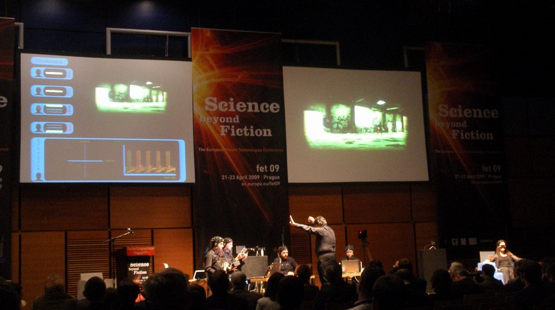
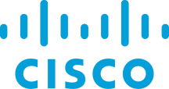

Services

# Build, advise, teach.

::: {.lede .muted}
Sisyphe is small on purpose. One senior engineer, with trusted collaborators when the work needs them, on problems where the model has to meet a real instrument, a real stage, a real signal or a real collection: music technology, creative tools, art and culture. If you are not sure your problem fits, write anyway.
:::

::: {.modes}
<a class="mode" href="#build">01 · Build<strong>We make the thing.</strong>Agents inside creative tools, music and audio ML, interactive art and installations.</a>
<a class="mode" href="#advise">02 · Advise<strong>We de-risk the thing.</strong>Research to product, fractional CTO and scientific advice for creative-tech teams and cultural institutions.</a>
<a class="mode" href="#teach">03 · Teach<strong>We make your team able to do it.</strong>Workshops and courses for studios, schools and art programs.</a>
:::

## Build {#build}

::: {.group-lede .muted}
Working software in your repo, measured against the real environment it has to run in.
:::

::: {.svcgrid}
::: {.svc .wide}

Music technology · creative tools

### Agents inside creative tools

perceivereasonact

You get an agent that can operate your whole application, and an evaluation that tells you when its coverage slips.

MCP servers and tool design for DAWs, plug-ins, creative apps and collections. We decide what the model should see and build the bridge into your object model or archive.

<ul class="proof"><li><a href="sideman.html">Sideman</a>: 922 reachable members of Live measured against a running instance, with change observers nothing else in the field has.</li><li>Persona: real-time conversational voice pipelines, as an embedded ML engineer.</li></ul>

:::

::: {.svc}

<svg class="ill" viewBox="0 0 400 300" role="img" aria-label="A waveform becoming a sequence of tokens">
  <g class="p">
    <rect x="40" y="130" width="6" height="40" rx="3"/><rect x="52" y="110" width="6" height="80" rx="3"/><rect x="64" y="95" width="6" height="110" rx="3"/><rect x="76" y="120" width="6" height="60" rx="3"/><rect x="88" y="80" width="6" height="140" rx="3"/><rect x="100" y="105" width="6" height="90" rx="3"/><rect x="112" y="135" width="6" height="30" rx="3"/><rect x="124" y="115" width="6" height="70" rx="3"/><rect x="136" y="90" width="6" height="120" rx="3"/><rect x="148" y="125" width="6" height="50" rx="3"/><rect x="160" y="140" width="6" height="20" rx="3"/>
  </g>
  <path class="ink" d="M185 150 L225 150 M216 142 L225 150 L216 158" stroke-width="2" fill="none" stroke-linecap="round"/>
  <g>
    <rect class="r" x="240" y="86" width="44" height="26" rx="5"/><text class="mono" x="262" y="99">say</text>
    <rect class="r" x="292" y="86" width="30" height="26" rx="5"/><text class="mono" x="307" y="99">it</text>
    <rect class="r" x="240" y="122" width="34" height="26" rx="5"/><text class="mono" x="257" y="135">it</text>
    <rect class="r" x="282" y="122" width="58" height="26" rx="5"/><text class="mono" x="311" y="135">lands</text>
    <rect class="r" x="240" y="158" width="30" height="26" rx="5"/><text class="mono" x="255" y="171">in</text>
    <rect class="r" x="278" y="158" width="48" height="26" rx="5"/><text class="mono" x="302" y="171">your</text>
    <rect class="a" x="240" y="194" width="42" height="26" rx="5"/><text class="mono" x="261" y="207">Set</text>
  </g>
  <text class="cap" x="40" y="280">asr · tts · diarization · lm</text>
</svg>

Music and audio

### Music, audio and voice ML

perceivereason

You get music and audio models that hold up in a product, not only on a benchmark.

Music source separation, audio classification and recommendation, speech recognition and synthesis, and the language models around them. Data pipelines, training, evaluation, and getting a model into a product people use without noticing it.

<ul class="proof"><li>Persona: real-time conversational voice pipelines.</li><li>Parts Order: scientific advice on music source separation.</li><li><a href="https://slegroux.github.io/nimrod">Nimrod</a> (personal, open source): a toolkit for speech, audio and language modelling.</li></ul>

Before Sisyphe Speech recognition and speaker diarization shipped to millions of Webex users at Cisco; speech and speaker recognition at Ava and Voicea.

:::

::: {.svc}

Interactive art

### Interactive art and installations

perceiveact

You get a real-time system that answers people, sensors or signals, with a mapping you can defend.

Real-time composition, sound, light and machines that respond to sensors, biosignals, movement or game state: installations, performances, robots on stage, museum and gallery prototypes. Psychoacoustics and emotion research underneath, so the mapping from signal to output is defensible rather than decorative.

Before Sisyphe The Brain Orchestra, XIM and the Sónar Robot Arena, built in research labs in Barcelona. See <a href="about.html#background">the background</a>.

:::

:::

::: {.svcgrid}
::: {.grp}
## Advise {#advise}

::: {.group-lede .muted}
Read the paper, run the experiment, and say plainly what will work before you build it.
:::

::: {.svc}

<svg class="ill" viewBox="0 0 400 300" role="img" aria-label="A paper turning into a shipped product">
  <g transform="translate(50 70)">
    <rect class="fill-panel ink" x="0" y="0" width="110" height="140" rx="6" stroke-width="2"/>
    <g class="ink3" stroke-width="3" stroke-linecap="round"><path d="M18 26 H70 M18 44 H92 M18 62 H84 M18 80 H92 M18 98 H60"/></g>
    <path class="rs" d="M18 116 H70" stroke-width="3" stroke-linecap="round"/>
    <text class="cap" x="0" y="165">paper · prototype</text>
  </g>
  <path class="ink" d="M180 140 L215 140 M206 132 L215 140 L206 148" stroke-width="2" fill="none" stroke-linecap="round"/>
  <g transform="translate(240 75)">
    <path class="a" d="M0 40 L55 12 L110 40 L55 68 Z" opacity="0.9"/>
    <path class="a" d="M0 40 L55 68 L55 130 L0 102 Z" opacity="0.7"/>
    <path class="a" d="M55 68 L110 40 L110 102 L55 130 Z" opacity="0.5"/>
    <path d="M40 72 L52 84 L76 56" stroke="var(--on-layer)" stroke-width="5" fill="none" stroke-linecap="round" stroke-linejoin="round"/>
    <text class="cap" x="0" y="165">shipped</text>
  </g>
</svg>

Any field

### Research to product, fractional CTO, scientific advice

reason

You get a senior second opinion, or your prototype turned into software, before you commit a team to it.

For creative-tech teams and cultural institutions: you have a paper, a lab prototype or a collection that needs to become software, or a team that needs a senior second opinion. We read the paper, talk to the scientists and ship the code, or sit beside your team as a fractional CTO or scientific advisor. A decade in research labs, a decade in industry.

<ul class="proof"><li>Tamada: fractional CTO for AI-augmented art curation, visual search over a collection from prototype to product with a team.</li><li>Parts Order: scientific advisor on music source separation.</li></ul>

Before Sisyphe Museaic Labs, an emotion-driven music recommendation system; technology transfer on interactive systems for autism with Fundación Orange and Universitat de València.

:::

:::

::: {.grp}
## Teach {#teach}

::: {.group-lede .muted}
So your team can do it without us.
:::

::: {.svc}

<svg class="ill" viewBox="0 0 400 300" role="img" aria-label="A whiteboard with the perceive, reason, act loop sketched on it, and a room of people">
  <rect class="fill-panel ink" x="60" y="34" width="280" height="150" rx="6" stroke-width="2"/>
  <g transform="translate(200 109) scale(0.42)">
    <circle cx="0" cy="0" r="120" fill="none" class="ink3" stroke-width="3"/>
    <path class="ps" d="M0,-120 A120,120 0 0 1 103.9,60" stroke-width="10" fill="none" stroke-linecap="round"/>
    <path class="rs" d="M103.9,60 A120,120 0 0 1 -103.9,60" stroke-width="10" fill="none" stroke-linecap="round"/>
    <path class="as" d="M-103.9,60 A120,120 0 0 1 0,-120" stroke-width="10" fill="none" stroke-linecap="round"/>
    <circle class="p" cx="0" cy="-120" r="26"/><circle class="r" cx="103.9" cy="60" r="26"/><circle class="a" cx="-103.9" cy="60" r="26"/>
  </g>
  <g class="ink3" stroke-width="3" stroke-linecap="round"><path d="M80 60 H120 M80 74 H110 M292 150 H320 M292 164 H312"/></g>
  <g class="ink" fill="none" stroke-width="2">
    <g transform="translate(90 232)"><circle cx="0" cy="0" r="9"/><path d="M-14 30 C-14 14, 14 14, 14 30"/></g>
    <g transform="translate(145 232)"><circle cx="0" cy="0" r="9"/><path d="M-14 30 C-14 14, 14 14, 14 30"/></g>
    <g transform="translate(200 232)"><circle cx="0" cy="0" r="9"/><path d="M-14 30 C-14 14, 14 14, 14 30"/></g>
    <g transform="translate(255 232)"><circle cx="0" cy="0" r="9"/><path d="M-14 30 C-14 14, 14 14, 14 30"/></g>
    <g transform="translate(310 232)"><circle cx="0" cy="0" r="9"/><path d="M-14 30 C-14 14, 14 14, 14 30"/></g>
  </g>
  <text class="cap" x="60" y="290">workshops · courses · studios</text>
</svg>

Education

### Teaching and workshops

perceivereasonact

You get a team that can build and run agents without us.

Sideman workshops for studios, schools and labs, from a day to a term, from “what’s in my Set?” to a finished track. Custom courses on agents for creative tools, audio machine learning and sensor-to-actuator systems.

<ul class="proof"><li>The <a href="course.html">Sideman course</a> is the current syllabus.</li><li><a href="https://slegroux.github.io/pappus/">Pappus</a>, our learning notebook: the AI hints, the learner runs the code.</li></ul>

Before Sisyphe Four graduate courses designed and taught at Georgia Tech and Pompeu Fabra University, one built around the sensor-to-actuator loop.

:::

:::
:::

## Worked with

::: {.worked .clients}
Clients
PersonaParts OrderTamada
:::

::: {.worked .before}
Before Sisyphe
VoiceaAva
StanfordMuseaic Labs
:::

## How it works

::: {.steps}
::: {.step}

1

### A written brief
Half a page: what you are building, where it is stuck, what a demo would need to show. We reply with a scope, a number of weeks and a price.
:::
::: {.step}

2

### Two to eight weeks
A fixed engagement with a clear question. Working code in your repo from the first week, a check-in each week, and no open-ended retainers.
:::
::: {.step}

3

### A demo, then a decision
It ends with the thing running in front of you and a written account of what worked and what did not. You decide what happens next.
:::
:::

::: {.note}
**Advisory** is the other shape: a few hours a month to review architecture, models or an agent design before you commit a team to it. **Open source first:** if the work belongs in Sideman or a public library, we will say so and price it accordingly.
:::

::: {.cta}
## Start a conversation {#contact}

Write with what you are building and where it is stuck. You will get a reply from the person who would do the work.

<a class="btn-accent" href="mailto:sylvain.legroux@gmail.com?subject=Working%20with%20Sisyphe">Write to us</a>

Or copy the address: <code>sylvain.legroux@gmail.com</code> <button type="button" class="copy-email" data-email="sylvain.legroux@gmail.com">Copy</button>

:::
